<div align="center">

<!-- Animated Header Banner -->


</div>

<div align="center">

<!-- Typing Animation -->
[](https://git.io/typing-svg)

</div>

---

<div align="center">

<!-- Profile Badges -->
[](https://linkedin.com/in/akshadadoke)
[](mailto:akshadadoke123@gmail.com)
[](https://github.com/akshadadoke)


</div>

---

## 👩‍💻 About Me

```yaml
Name        : Akshada Doke
Pronouns    : She/Her
Location    : Pimpri, Maharashtra, India 🇮🇳
Role        : Cloud & DevOps Engineer | Linux Admin | web developer | Data Analyst
Focus       : Cloud Architecture • Infrastructure Automation • Backend Systems
Learning    : AWS Solutions Architect • Kubernetes • Terraform • Python (Scripting used to Automation script)
Open To     : Open-Source Collaborations • Cloud-Native Projects 
Fun Fact    : Always learning something new skills
```

---

## ☁️ Cloud & DevOps Skills

<div align="center">

### ☁️ AWS Services


### 🐧 Linux & Infrastructure


### 🔁 DevOps & CI/CD


</div>

---

## 💻 Development Skills

<div align="center">

### 🚀 Languages


### 🗄️ Databases


### 🛠️ Tools


</div>

---

## 📊 GitHub Stats

<div align="center">


</div>

<div align="center">

[](https://git.io/streak-stats)

</div>

---

## 🏆 GitHub Trophies

<div align="center">

[](https://github.com/ryo-ma/github-profile-trophy)

</div>

---

## 🗺️ Cloud Architecture Roadmap

```mermaid
graph LR
    A[👩‍💻 Backend Dev] --> B[☁️ Cloud Fundamentals]
    B --> C[🟠 AWS Core Services]
    C --> D[🐧 Linux & Networking]
    D --> E[🐳 Docker & Containers]
    E --> F[⚙️ Kubernetes Orchestration]
    F --> G[🔁 CI/CD Pipelines]
    G --> H[🏗️ IaC with Terraform]
    H --> I[📊 Monitoring & Observability]
    I --> J[🚀 Cloud-Native Architect]
    style J fill:#00d4ff,color:#000
    style A fill:#a78bfa,color:#000
```



---

## 🌟 Featured Projects

<div align="center">

| Project | Description | Stack |
|--------|-------------|-------|
| 🌐 **Cloud Deployment Pipeline** | Automated AWS deployment with CI/CD using GitHub Actions + Docker | `AWS` `Docker` `GitHub Actions` `Terraform` |

| 📊 **DevOps Dashboard** | Real-time monitoring dashboard with Prometheus & Grafana | `Docker` `Prometheus` `Grafana` `Linux` |


</div>

---

## 📜 Certifications (In Progress)

<div align="center">

| Certification | Provider | Status |
|--------------|----------|--------|
| ☁️ Master in Cloud Architecture | Fortune Clound Technologies | 🔄 In Progress |
| ☁️ AWS cloud Practioner Essentials |
| ☁️ AWS Technical Essentials |

</div>

---

## 📈 Contribution Activity

<div align="center">

[](https://github.com/ashutosh00710/github-readme-activity-graph)

</div>

---

## 🤝 Let's Connect & Collaborate

<div align="center">

> 💡 *"The best way to predict the future is to architect it in the cloud."*

[]((https://www.linkedin.com/in/akshada-doke-93616034b/))
[](mailto:akshadadoke123@gmail.com)
[]
(https://github.com/Akshada-Doke)


**Open to:** Cloud Engineering Roles · DevOps Internships · Open-Source Collaboration · Backend Projects

</div>

---

<div align="center">


</div>
